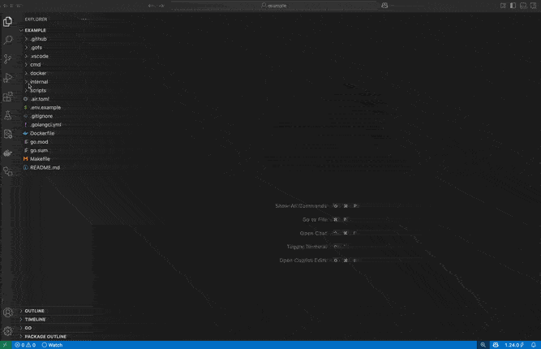

# Gofs for Visual Studio Code

[Gofs](https://gofs.dev) provides lightweight templates for secure full-stack go apps.

## Features

- Invalid uris

## Requirements

- [Gofs](https://gofs.dev)
- Go 1.23

## Extension Settings

Currently no settings

## Known Issues

Currently no known issues

## Release Notes
