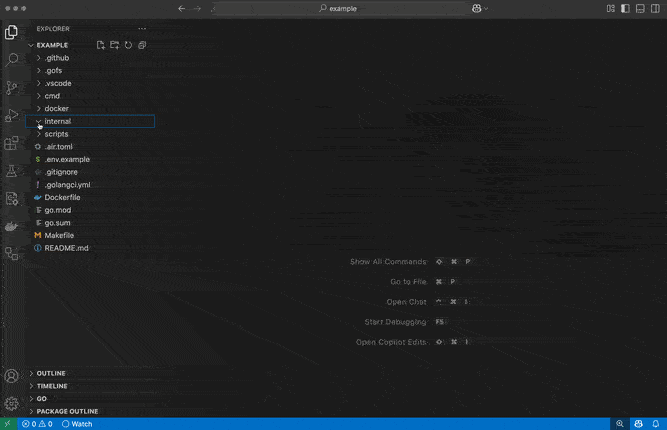

# Gofs for Visual Studio Code

[Gofs](https://gofs.dev) provides lightweight templates for secure full-stack go apps.

## Features

Gofs helps you write apps that have go frontends and backends, bringing go's backward compatibility commitment to your entire app. Gofs templates are built using [Alpine.js](https://alpinejs.dev), [htmx](https://htmx.org), and [templ](https://templ.guide).

- This VSCode plugin helps you navigate to route definitions and handlers from hx links in your pages.

- Highlight invalid uris in routing and hx links

- Highlight broken hx links
- Warn about antipatterns for hx-links

## Requirements

- [Gofs](https://gofs.dev)
- Go 1.23

## Extension Settings

Currently no settings

## Known Issues

Currently no known issues

## Release Notes
